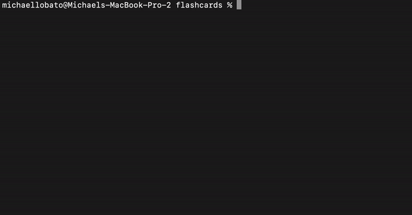

# [Flashcards](https://github.com/mrlobatoman/flashcards) 

### Abstract:
An interactive trivia game that can be played though the terminal. Upon starting the game, the user is given a question and three optional answers, upon selecting, the user will be informed if the answer was correct or incorrect. After all questions have been answered (30) the user will be informed that the round is over and the console will display the percentage of questions answered correctly. 

### Installation Instructions:
1. Open terminal and navigate where you would like to store the application. 
1. Click `SSH` and copy and paste `git@github.com:mrlobatoman/flashcards.git` into your terminal.
1. `cd` into the repository on your local machine and run `npm install` or `npm i` to install project dependencies.
1. Run `node index.js` in the terminal to start the game!
1. Toggle between answers using arrow keys and hit return to select answer, hit return again to move to the next question
1. `Control + C` is the command to stop running the game. 

### Preview of App:

### Context:

This project was completed in the 7th week of the Turing front-end software engineering program. The focal point was to implement test driven development and insure that all methods were functioning properly before launching the flashcards game. 

### Contributors:

- [Michael](https://github.com/mrlobatoman)

### Learning Goals:
- Use object and array prototype methods to perform data manipulation
- Implement ES6 classes with a complex data model
- Implement a robust testing suite using TDD

### Technologies Used:
- Git/GitHub
- JavaScript
- Mocha JavaScript testing framework
- Chai assertion library
- Test driven development

### Wins + Challenges:

#### Wins:
- Catching bugs and mistakes within the round file through TDD.
- Having a good gitworkflow in terms of PR's, naming conventions, etc.
- Getting a fully functional game to display within the terminal.

#### Challenges:
- The abstract - figuring out what needs to happen with every file and how they interact upon starting the game.